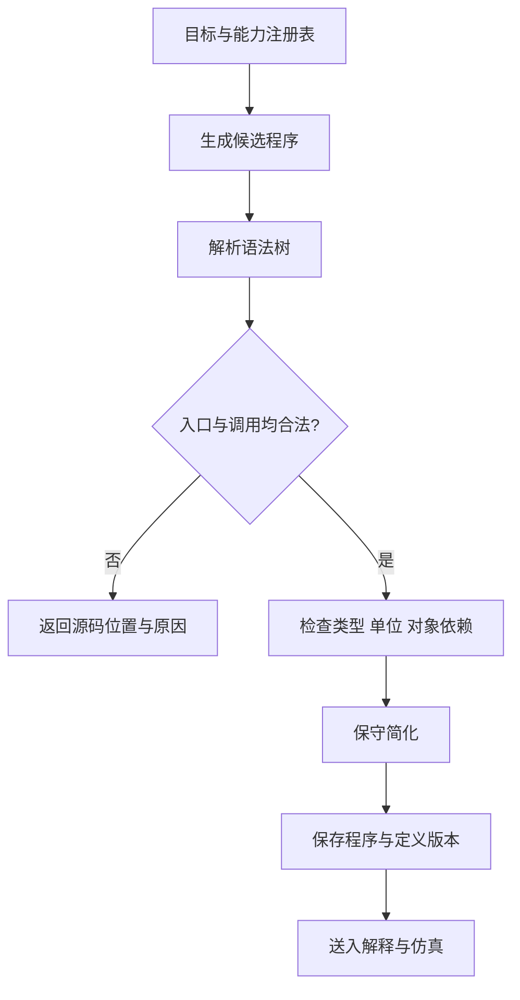

编译器处理两件事：先把设备资料整理为可以调用和检查的函数契约，再把实验目标整理为只使用这些函数的候选程序。生成模型可以建议步骤；可调用范围由审核后的能力注册表决定。

## 能力编译

每个函数必须绑定到明确的设备与动作版本，保留参数、单位、输入状态、必检条件、建议条件、状态效果、结果及错误说明。同名动作使用设备限定名区分，不能按名称猜测它们可以互换。

能力编译输出三类内容：供生成器读取的函数说明、共享类型与注册表、供仿真器调用的检查和状态转换实现。函数说明中的占位函数体不代表驱动已经实现；文档齐全也不代表设备在线。

参数有效范围取动作契约、协议编码和适用部署限制的交集。厂家范围未知时要记录缺失，不能把软件策略上限写成厂家验证上限。

## 程序编译

输入包括实验目标、成功条件、对象初态及能力版本。输出保留动作绑定、参数、对象引用、控制结构和证据依赖。



准入检查限定入口、导入、可调用函数和允许的语法结构，拒绝动态调用、通配导入及未登记操作。AST 检查属于程序准入；运行模型生成的 Python 还需要独立进程、资源限制和隔离环境，不能将检查通过等同于执行沙箱。

## 简化策略

可以折叠纯常量表达式、删除确定不会执行的常量分支、去掉空语句。每次修改都要保留源码位置映射并重新检查、重新仿真。

默认保留设备调用顺序、次数、对象和参数。合并两次加液、删掉暂未使用的输出或重排操作都可能改变实验含义；只有动作契约明确允许且重新验证通过时，才能采用这些变换。诊断改写也必须有次数上限，不能一直生成直到偶然通过。

以下可运行示例展示最小动作绑定检查，不是完整 Python 准入器：

```python
def bind_call(device_id, action, params, registry):
    """按明确设备和动作查找契约，拒绝未声明参数。"""
    key = (device_id, action)
    if key not in registry:
        raise ValueError("设备未登记该动作")
    spec = registry[key]
    missing = set(spec["required"]) - params.keys()
    extra = params.keys() - set(spec["parameters"])
    if missing or extra:
        raise ValueError(f"缺少参数 {sorted(missing)}；多余参数 {sorted(extra)}")
    return {"device_id": device_id, "action": action,
            "params": dict(params), "contract_version": spec["version"]}
```

绑定后仍需根据契约检查类型、有限数值、单位、范围和跨字段条件。例如布尔值不能因为 Python 把它视为整数就通过整数参数检查。

## 从程序到执行计划

程序中的对象及操作结构与执行后端的传输格式分开维护。输出 `Plan v1` 时，将动作映射到 `action/params`，对象映射到 `containers`，设备与对象预期版本映射到 `expected`。版本、完成条件和源码映射等审计资料应另行关联到计划，不能添加 Schema 不允许的字段。

当前顺序转换只适用于已经解析为确定顺序、参数可序列化的程序段。遇到依赖未来测量的条件、循环或并行节点，应保留给上层解释器处理，或者报告后端不支持。静态遍历 `if` 的两个分支并收集其中调用，会改变程序含义。

编译完成只表示得到可验证程序；进入执行前还要完成[仿真](/docs/specification/engine/simulator)和[运行时校验](/docs/specification/engine/executor)。
