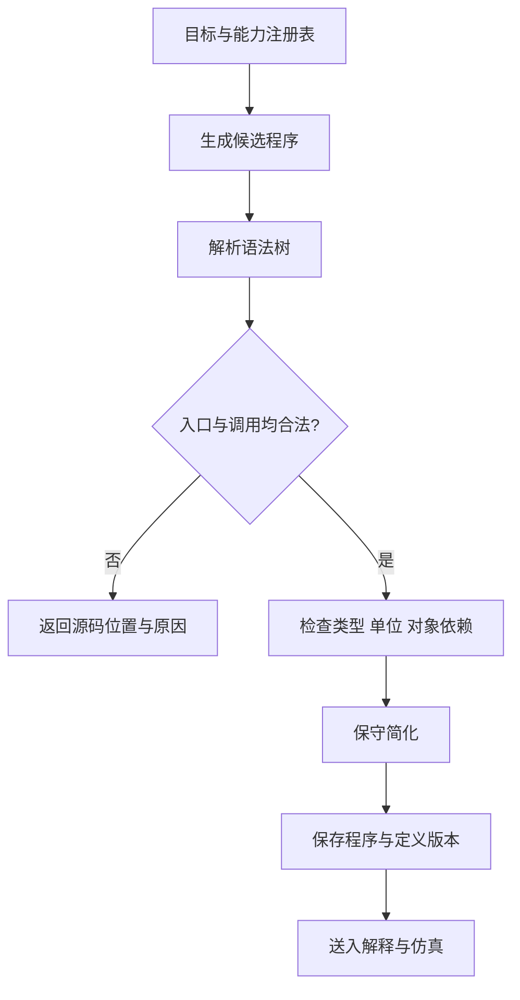
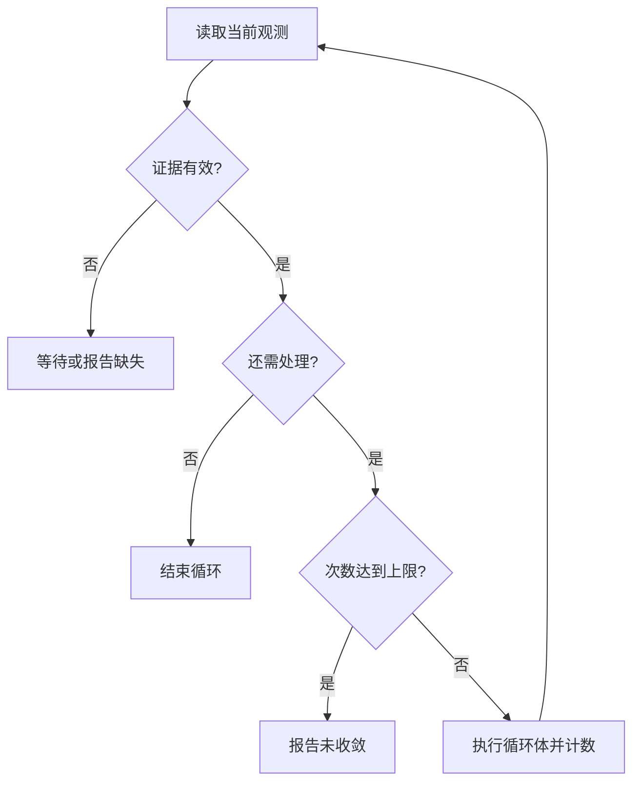

编译/解释器把设备资料整理成可以调用和检查的函数契约，把实验目标编译成只使用已登记能力的程序，再根据对象状态和当前证据推进程序路径。生成模型可以建议步骤；可调用范围由审核后的能力注册表决定。

## 能力编译

每个函数必须绑定到明确的设备与动作版本，保留参数、单位、输入状态、必检条件、建议条件、状态效果、结果及错误说明。同名动作使用设备限定名区分，不能按名称猜测它们可以互换。

能力编译输出三类内容：供生成器读取的函数说明、共享类型与注册表、供仿真器调用的检查和状态转换实现。函数说明中的占位函数体不代表驱动已经实现；文档齐全也不代表设备在线。

参数有效范围取动作契约、协议编码和适用部署限制的交集。厂家范围未知时要记录缺失，不能把软件策略上限写成厂家验证上限。

## 程序编译

输入包括实验目标、成功条件、对象初态及能力版本。输出保留动作绑定、参数、对象引用、控制结构和证据依赖。



准入检查限定入口、导入、可调用函数和允许的语法结构，拒绝动态调用、通配导入及未登记操作。AST 检查属于程序准入；运行模型生成的 Python 还需要独立进程、资源限制和隔离环境，不能将检查通过等同于执行沙箱。

## 程序解释

解释阶段沿程序结构运行，保存变量、对象引用、分支结果和循环次数。每遇到一个设备动作，就把已求值的参数交给选定后端：验证阶段交给仿真器，真实运行阶段交给执行服务。

条件读取的观测要关联对象、任务、时间和有效性。值为未知、过期或属于其他样品时，应返回“等待证据”或诊断。不能把未知当成假，也不能为了继续运行而虚构测量值。

仿真中的假设输入只用于覆盖相应分支。一次仿真走过一条路径，不能证明其他分支全部正确；测试条件程序时应分别提供不同观测，并记录覆盖了哪些路径。

## 有界循环与未收敛

以下伪代码描述“检测不达标时继续处理”的逻辑。检测动作与处理动作都必须来自能力注册表：

```python
def interpret_loop(body, observe, guard, max_iterations):
    for iteration in range(max_iterations + 1):
        evidence = observe()
        require_current_evidence(evidence)
        if not guard(evidence):
            return {"status": "converged", "iterations": iteration}
        if iteration == max_iterations:
            return {"status": "not_converged", "evidence": evidence}
        body()
```

未收敛是正常的可报告结果，不能自动扩大最大次数，也不能把最后一次处理成功当成实验目标达标。



## 并行与保护区间

并行分支分别使用状态副本，记录读集合与写集合。汇合前检查写入冲突及依赖冲突；冲突不能通过“后一个覆盖前一个”解决。实际调度还要检查设备和资源互斥。当前参考代码的并行上下文标记不证明已经实现线程并发或硬件调度。

保护区间要求指定操作连续占用所声明的资源。离开区间时需要按真实完成或停止状态释放资源；异常退出不意味着设备已经安全停止，也不意味着样品变化可以回滚。

## 简化策略

可以折叠纯常量表达式、删除确定不会执行的常量分支、去掉空语句。每次修改都要保留源码位置映射并重新检查、重新仿真。

默认保留设备调用顺序、次数、对象和参数。合并两次加液、删掉暂未使用的输出或重排操作都可能改变实验含义；只有动作契约明确允许且重新验证通过时，才能采用这些变换。诊断改写也必须有次数上限，不能一直生成直到偶然通过。

以下可运行示例展示最小动作绑定检查，不是完整 Python 准入器：

```python
def bind_call(device_id, action, params, registry):
    """按明确设备和动作查找契约，拒绝未声明参数。"""
    key = (device_id, action)
    if key not in registry:
        raise ValueError("设备未登记该动作")
    spec = registry[key]
    missing = set(spec["required"]) - params.keys()
    extra = params.keys() - set(spec["parameters"])
    if missing or extra:
        raise ValueError(f"缺少参数 {sorted(missing)}；多余参数 {sorted(extra)}")
    return {"device_id": device_id, "action": action,
            "params": dict(params), "contract_version": spec["version"]}
```

绑定后仍需根据契约检查类型、有限数值、单位、范围和跨字段条件。例如布尔值不能因为 Python 把它视为整数就通过整数参数检查。

## 从程序到执行计划

程序中的对象及操作结构与执行后端的传输格式分开维护。生成执行计划时，将动作映射到 `action/params`，对象映射到 `containers`，设备与对象的预期版本映射到 `expected`。版本、完成条件和源码位置等审计资料应另行关联到计划，不能添加数据格式不允许的字段。

当前顺序转换只适用于已经解析为确定顺序、参数可序列化的程序段。遇到依赖未来测量的条件、循环或并行节点，应保留给解释阶段处理，或者报告后端不支持。静态遍历 `if` 的两个分支并收集其中调用，会改变程序含义。

当前执行计划以顺序步骤为主。编译/解释器可以把决策前已经确定的一段步骤交给执行器，等该段结束并取得有效观测后，再选择和生成下一段。每段拥有独立幂等键，同一段重试复用原键。

生成新段后必须再次检查该段，不能因为原始程序已经仿真就跳过新参数、新对象状态的校验。尚未实现的控制结构应明确拒绝，避免输出看起来合法但含义已经改变的计划。

编译完成只表示得到可验证程序，解释完成只表示得到当前证据下的程序路径；进入执行前还要完成[仿真](/docs/specification/engine/simulator)和[运行时校验](/docs/specification/engine/executor)。
