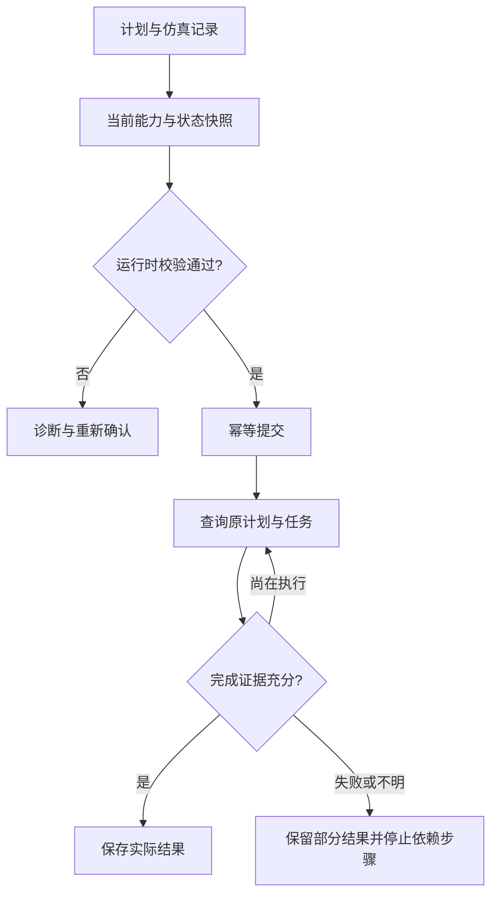

执行器接收已经通过仿真的实验任务流程，解析其中可下发的任务、参数、对象和步骤依赖。每段任务下发前，执行器重新向 FSP 查询设备能力和当前状态，确认设备在线、可用且现场条件满足，再把任务交给 FSP 执行，并持续跟踪实际结果。

编译/解释器处理流程中的顺序、条件和循环；执行器把当前已经确定且通过校验的任务段落实到具体设备、请求和任务记录。依赖未来测量的分支要等待 FSP 返回有效证据后再解释和验证下一段。

## 下发前确认可用设备

规划阶段使用的能力说明记录设备能做什么。下发前还要向 FSP 获取最新的在线、故障、忙闲、资源占用、标定与安全状态，以及相关对象的位置、状态、观测时间和版本。未知或过期的信息必须先补齐。

流程已绑定具体设备时，执行器确认该设备现在可用。若流程保留候选设备，执行器只能从已验证的候选和使用条件中确认设备；最终绑定影响动作、单位、参数、对象条件或约束时，需返回编译/解释与仿真，取得匹配的验证记录。

设备暂时忙碌时，按服务规则等待后重新查询。没有合适设备、能力发生变化或现场条件使原流程失效时，返回原因和最新状态，由语言引擎通过 Agent 调整剩余流程并重新校验。已完成步骤及其证据继续保留。

## 执行器接收什么

当前执行器接收顺序执行计划。一份计划至少包含一个稳定的幂等键、按顺序排列的步骤，以及设备和对象的预期版本。

```json
{
  "plan_version": "1",
  "idempotency_key": "experiment-001-plan-001",
  "steps": [
    {
      "id": "sonicate",
      "device_id": "site-sonicate",
      "action": "sonicate",
      "params": {"duration_s": 300},
      "containers": ["sample-01"]
    },
    {
      "id": "centrifuge",
      "device_id": "site-centrifuge",
      "action": "centrifuge_start",
      "params": {"program_duration_s": 600, "speed_rpm": 3000},
      "containers": ["sample-01"],
      "preconditions": ["balanced", "lid_closed"]
    }
  ],
  "max_duration_s": 1200,
  "expected": {
    "devices": {
      "site-sonicate": "system-revision-31",
      "site-centrifuge": "system-revision-18"
    },
    "objects": {
      "sample-01": "object-revision-7"
    }
  }
}
```

上例只展示计划字段，编号和版本为示意值。真实执行还需确认转移、装载、配平、关盖和离心配置读回；这两步不是可以直接下发的完整实验。

这份结构仍然表达 FSP 要求的三个维度，只是没有拆成三套接口：

| 维度 | 计划中的内容 | 执行时核对的内容 |
| --- | --- | --- |
| 操作 | `action`、`params`、`preconditions` | 动作是否受支持、参数是否有效、完成条件是否满足 |
| 对象 | `containers`、`expected.objects` | 容器是否已登记、位置和状态是否有效、版本是否还是计划使用的版本 |
| 系统 | `device_id`、`expected.devices`、`idempotency_key` | 设备状态、能力、权限、资源锁、安全条件、任务和系统版本 |

编译/解释器可以先生成计划骨架，但不能凭空填写当前版本。`containers` 中只能引用已经登记的对象编号；`expected.devices` 和 `expected.objects` 必须来自执行前的新快照。占位文字不能提交给设备。

## 执行顺序

执行器按下面的顺序处理一份计划：

1. **确认来源**：计划必须已经通过仿真；仿真输出只说明计划可继续检查，不代表设备已经执行。
2. **解析任务并确认设备**：解析步骤、参数、对象和依赖；向 FSP 调用等价的 `get_capabilities` 和 `get_snapshot`，取得最新能力、使用边界、约束、系统与对象版本及现场状态，确认目标设备当前可用。能力或状态变化影响仿真依据时，返回重新验证。
3. **补齐运行时数据**：把已登记的容器编号和快照中的版本写入计划；为整份计划保存一个稳定的幂等键。
4. **检查计划结构**：按照执行计划的数据格式检查必填字段、字段类型、步骤编号和计划大小。结构检查通过只代表 JSON 可读取。
5. **运行时校验**：调用等价的 `validate_plan`，核对动作、参数、对象、版本、权限、安全限制、资源冲突和现场前提。
6. **提交一次**：校验通过后向 FSP 调用等价的 `submit_plan`。FSP 在每个动作执行前取得资源并再次门控。网络重试继续使用原幂等键，不生成另一份计划。
7. **跟踪原任务**：保存返回的计划编号和任务编号，持续通过等价的 `get_plan`、`get_task` 和 `get_snapshot` 查询同一批记录。
8. **核对完成证据**：只有每一步自己的完成条件都满足，执行器才把该步标为成功；随后更新对象和系统版本，再处理依赖它的下一步。
9. **收口结果**：计划结束时保存对象变化、实际参数、设备观测、诊断、时间和版本。失败、取消或结果不明时也必须保留已经确认的部分结果。

下面的伪代码只说明逻辑，不限定 HTTP 路径、MCP 工具名或具体编程语言：

```python
def execute(plan, simulation_result):
    require_matching_passed_simulation(plan, simulation_result)

    capabilities = get_capabilities(plan.device_ids)
    snapshot = get_snapshot(plan.device_ids, plan.container_ids)
    if not devices_available(capabilities, snapshot):
        return availability_diagnostic(capabilities, snapshot)
    if affects_validated_flow(plan, simulation_result, capabilities, snapshot):
        return request_replanning_and_simulation(plan, snapshot)
    plan = reconcile_plan_with_snapshot(plan, snapshot)
    # 状态或参数改变时重新验证，不能覆盖旧版本后直接继续

    check_plan_schema(plan)             # 只检查结构
    validation = validate_plan(plan, capabilities, snapshot)
    if not validation.passed:
        return validation.failure

    persist_plan_and_idempotency_key(plan)
    receipt = submit_plan(plan)

    while True:
        plan_status = get_plan(receipt.plan_id)
        tasks = query_known_tasks(plan_status)
        snapshot = get_snapshot(plan.device_ids, plan.container_ids)
        reconcile(tasks, snapshot)
        if plan_status.is_terminal:
            break
        wait_for_event_or_poll_interval()

    return get_plan(receipt.plan_id)
```

上述函数名表示 FSP 应提供的等价能力，具体名称由实现确定。`submit_plan` 返回成功只说明 FSP 服务收到了计划。即使某一步已经 `accepted`，也不能写成 `completed`；连接正常、命令已发送或设备已经停机，也不一定满足该动作的完成条件。

## 每一步怎样放行



FSP 服务执行到某一步时，至少按以下顺序检查：

1. 该设备当前仍支持计划中的动作和参数；
2. 对象版本与执行记录中的预期一致，对象位置和状态仍可用；
3. 系统版本与执行记录中的预期一致，设备没有被其他任务占用；
4. 操作契约要求的权限、安全限制和现场条件都有可追溯证据；
5. 所需资源已锁定，而且不会与其他任务同时操作同一对象或设备；
6. 通过转发器把操作、对象、系统三方面信息转换成设备仪器接口需要的命令；
7. 保存原始回执，并按照动作契约继续读取完成证据。

计划的 `expected` 建立提交时的版本基线。计划自身执行造成的版本变化，应根据已确认结果推进执行记录，并保留原始计划；后续步骤不能永远与起始版本比较，也不能接受无来源的外部版本变化。

发现版本冲突时，不能把计划里的旧版本直接改成新版本后继续。执行器应停止受影响的步骤，保留冲突记录，并让上层根据新的现场状态重新确认或重新生成计划。

## 设备步骤怎样排列

当前执行计划采用“同一设备连续成段”的安排。属于同一台设备的步骤必须放在一起；计划切换到另一台设备后，不再返回前一台设备。

```text
清洗设备：设置 → 加注 → 查询
    ↓ 由上层流程或人工完成样品转移
超声设备：超声处理
    ↓ 由上层流程或人工完成样品转移与配平
离心设备：配置 → 关盖 → 启动 → 查询 → 开盖
```

设备之间的切换表示样品发生了物理转移，不表示两台设备之间存在直接调用关系。转移、装载、配平等动作如果没有自动设备提供，就由上层流程或人工完成并记录证据。

需要多轮返回同一设备的工艺，例如“离心—清洗—再次离心”，当前实现应拆成多份计划，由上层流程依次编排。这样可以明确每次物理转移的责任和现场确认点。

## 怎样判断完成

完成条件由具体动作契约决定，不能用统一的“接口返回 200”代替。例如离心启动动作至少需要核对：

- 本轮确实观察到转子开始转动；
- 程序剩余时间已经归零；
- 实际转速已经回到零；
- 设备给出的程序完成和转子停止状态一致；
- 对象、盖状态、配平等需要保留的证据仍能对应到本任务。

如果只确认设备已经停机，却无法确认样品实际经历了要求的操作，结果应标为未知，而不是成功。请求参数也不能直接抄到“实际参数”中；只有设备回读或测量得到的值才能作为实际结果。

## 仿真与真实执行的边界

仿真器可以检查：

- 动作是否存在，参数类型和范围是否正确；
- 契约、设备协议编码和当前部署限制的已知交集；
- 从步骤顺序能够推导出的设备局部状态；
- 同一设备是否被拆成多个不连续的操作段。

仿真器不能代替运行时确认：

- 对象和系统版本是否仍为最新；
- 设备是否在线、空闲，资源锁是否可取得；
- 样品是否已经装载、管路是否就绪、离心管是否配平；
- 真实设备是否执行，以及动作是否达到科学或物理完成条件。

因此，仿真中的 `succeeded` 只表示该步骤通过了仿真能够执行的必检项。仿真留下的现场条件警告必须在 `validate_plan` 或步骤放行前由设备观测、登记数据或有来源的人工记录解决。

## 重试、取消和结果不明

- 首次提交前保存计划幂等键；相同计划重试必须复用原键。
- 程序重启后先查询原计划和原任务，不能重新发送结果不明的动作。
- 取消请求只表示请求取消；设备是否已经停止、能否安全中断，要读取任务和设备状态确认。
- 机械动作不一定可逆。需要补救时，把补救作为新的操作，重新检查权限、条件、资源和幂等键。
- 某一步只完成一部分时，保留已确认的对象变化和设备状态，不把整步伪装成完全失败或完全成功。
- 计划超过 `max_duration_s` 后进入超时处理，但超时本身不能证明设备已经停止。

最终结果必须能够回答四个问题：提交的是哪份计划、每一步实际执行到哪里、哪些对象和系统状态有证据、还有哪些结果未知。只有全部必需步骤达到各自完成条件，整份计划才能标为完成。
