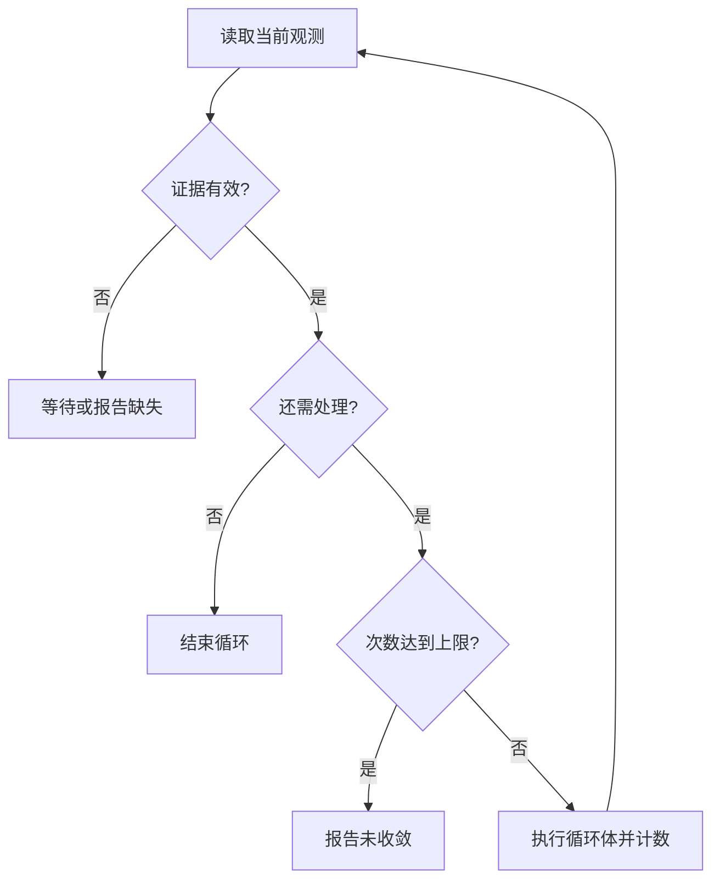

解释器沿着程序结构运行，保存变量、对象引用、分支结果和循环次数。每遇到一个设备动作，就把已求值的参数交给选定后端：验证阶段交给仿真器，真实运行阶段交给执行服务。

## 条件必须来自有效证据

条件读取的观测要关联对象、任务、时间和有效性。值为未知、过期或属于其他样品时，应返回“等待证据”或诊断。不能把未知当成假，不能为了继续运行而虚构测量值。

仿真中的假设输入只用于覆盖相应分支。一次仿真走过一条路径，不能证明其他分支全部正确；测试条件程序时应分别提供不同观测，并记录覆盖了哪些路径。

## 有界循环与未收敛

以下伪代码描述“检测不达标时继续处理”的逻辑。检测动作与处理动作都必须来自能力注册表：

```python
def interpret_loop(body, observe, guard, max_iterations):
    for iteration in range(max_iterations + 1):
        evidence = observe()
        require_current_evidence(evidence)
        if not guard(evidence):
            return {"status": "converged", "iterations": iteration}
        if iteration == max_iterations:
            return {"status": "not_converged", "evidence": evidence}
        body()
```

未收敛是正常的可报告结果，不能自动扩大最大次数，也不能把最后一次处理成功当成实验目标达标。



## 并行与保护区间

并行分支分别使用状态副本，记录读集合与写集合。汇合前检查写入冲突及依赖冲突；冲突不能通过“后一个覆盖前一个”解决。实际调度还要检查设备和资源互斥。当前参考代码的并行上下文标记不证明已经实现线程并发或硬件调度。

保护区间要求指定操作连续占用所声明的资源。离开区间时需要按真实完成或停止状态释放资源；异常退出不意味着设备已经安全停止，也不意味着样品变化可以回滚。

## 与顺序计划衔接

当前 `Plan v1` 以顺序步骤为主。解释器可以把决策前已经确定的一段步骤交给执行器，等该段结束并取得有效观测后，再选择和生成下一段。每段拥有独立幂等键，同一段重试复用原键。

生成新段后必须再次检查该段，不能因为原始程序已经仿真就跳过新参数、新对象状态的校验。尚未实现的控制结构应明确拒绝，避免输出看起来合法但含义已经改变的计划。
