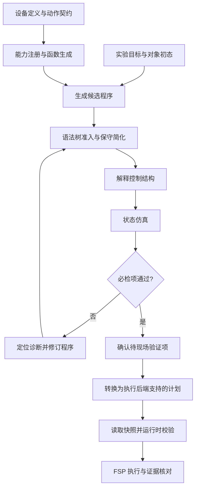

ALL 语言引擎把实验目标整理成可检查的程序，再将通过检查的步骤交给 FSP 服务执行。程序始终围绕同一批样品和容器展开：它们现在在哪里、处于什么状态、操作之后应发生什么变化，以及这些变化由什么证据确认。

## 核心原理：带条件的状态转换

用 `S` 表示当前对象状态，用 `θ` 表示操作参数，用 `P(S, θ)` 表示操作必须满足的条件。只有条件成立，仿真才能应用操作的状态效果：

```text
P(S, θ) 成立：S_next = apply_effect(S, θ)
P(S, θ) 不成立：保留 S，返回定位到步骤的诊断
```

例如加液要同时检查来源余量、目标剩余容量、容器状态、参数单位和设备能力。通过后，仿真更新来源和目标的预测体积。实际执行时还要读取设备和对象证据，不能把预测体积直接作为测量值。

对象状态至少区分身份、样品、容器、位置、证据和来源。未知值保持未知；每项操作只读取它声明需要的字段。多个对象参与同一动作时，检查和更新必须覆盖整个对象集合。

## 三部分怎样配合

| 部分 | 负责什么 | 交付什么 |
| --- | --- | --- |
| 编译/解释器 | 将设备定义整理为函数契约，将目标整理为程序，并根据证据推进路径 | 注册表、程序结构、实际路径与控制状态 |
| 仿真器 | 在隔离状态中检查前提，再提交预测变化 | 诊断、预测状态、仍需现场确认的条件 |
| 执行器 | 准备计划、提交任务、跟踪真实反馈 | 任务结果、实际对象变化和完成证据 |

编译/解释器与仿真器协同工作：前者决定“下一步调用什么”，后者决定“该调用在当前模型状态下是否成立”。Python 是当前参考代码使用的程序载体，不意味着任意 Python 程序都是合法 ALL 程序。



## 五种组合策略

| 结构 | 表达的实验逻辑 | 必须检查 |
| --- | --- | --- |
| 顺序 | 前一步产物进入下一步 | 对象类型、状态与位置能够衔接 |
| 有界循环 | 重复处理直到达标 | 最大次数；到达上限仍不满足时报告未收敛 |
| 条件 | 根据检测结果选择路径 | 证据有效；只能选择允许的一条分支 |
| 并行汇合 | 独立样品分别处理后汇总 | 分支写集合不冲突；共享资源可用；结果可合并 |
| 保护区间 | 一组操作保持连续 | 声明资源与顺序；不得被冲突操作穿插 |

这些结构可以嵌套，但执行后端必须明确支持相应语义。保护区间不表示实验可回滚；并行写集合无冲突也不表示两条分支可以同时占用同一仪器。

## 当前落地范围

当前三设备生成物提供动作函数、局部状态仿真和顺序 `Plan v1` 示例。计划中的步骤没有通用的分支、循环和并行节点。涉及测量决策的程序，应由上层在取得新证据后选择下一段计划；无法保留语义的结构必须拒绝转换，不能把所有分支摊平成动作列表。

文档中的代码分为可直接运行的原理示例和标明用途的伪代码。它们说明设计规则，不表示本仓库已经实现完整语言运行时。形式检查证明的是已编码约束下的一致性；化学结果、硬件可靠性和现场安全仍需要相应证据。

继续阅读：[编译/解释器](/docs/specification/engine/compiler)、[仿真器](/docs/specification/engine/simulator)、[执行器](/docs/specification/engine/executor)。
