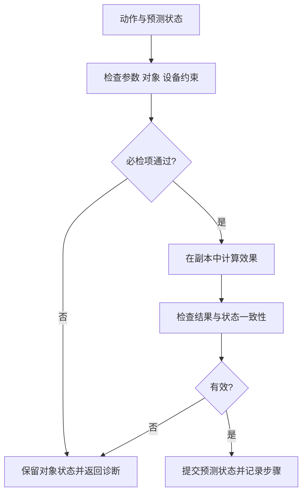

仿真器接收编译/解释器整理后的实验任务流程，以及语言引擎从 FSP 获取的能力、使用边界、约束和对象初态。它在独立状态副本中逐步计算预测变化并校验条件，把计算结果和问题反馈给 Agent，供下一轮修订使用。当前参考实现以规则和状态检查为主；只有明确提供模型的量才能计算，未建模的化学反应或设备动力学结果应标明未验证。

## 计算、校验与循环反馈

计算用于回答“执行这一步后预计发生什么”，例如声明了体积可加和模型时的来源余量、目标体积，以及设备状态的预计变化。校验用于回答“这一步是否满足能力范围、对象条件、顺序依赖和安全约束”。每个计算结果都要说明使用的模型、输入和假设。

一次仿真返回预测状态、已检查条件、出错步骤、违反的约束和待现场确认项。Agent 根据这些信息修订候选流程，再由编译/解释器检查，并重新仿真。循环在必检项通过时结束；达到修订上限、缺少必要信息或现有能力无法满足实验目的时，返回明确原因。

通过记录必须关联具体流程、参数、能力版本和初始状态。修订后使用新记录；不能沿用旧流程的通过结论。待现场确认项随流程交给执行器，在下发前由 FSP 的实时信息和有来源的现场记录核对。

## 先检查，再更新

动作先收集全部适用条件，再决定是否提交状态效果。必检条件失败时，受影响的预测状态保持不变；诊断日志可以追加。建议条件形成警告，并保留处理结论。



以下可运行 Python 示例演示无损加液。体积可加和是示例假设，不代表真实测量：

```python
from copy import deepcopy
from math import isfinite

def simulate_transfer(state, source, target, volume_ml):
    """失败保留输入状态，成功返回新的预测状态。"""
    errors = []
    if source == target:
        errors.append("来源和目标不能相同")
    if source not in state or target not in state:
        errors.append("对象未登记")
    if (type(volume_ml) not in (int, float)
            or not isfinite(volume_ml) or volume_ml <= 0):
        errors.append("体积必须是有限正数，单位 mL")
    if errors:
        return state, errors
    src, dst = state[source], state[target]
    for obj in (src, dst):
        for field in ("volume_ml", "capacity_ml"):
            value = obj.get(field)
            if type(value) not in (int, float) or not isfinite(value) or value < 0:
                errors.append(f"{field} 未知或无效")
    if errors:
        return state, errors
    if any(obj["volume_ml"] > obj["capacity_ml"] for obj in (src, dst)):
        errors.append("初始体积超过容量")
    if src["volume_ml"] < volume_ml:
        errors.append("来源余量不足")
    if dst["volume_ml"] + volume_ml > dst["capacity_ml"]:
        errors.append("目标容量不足")
    if errors:
        return state, errors
    predicted = deepcopy(state)
    predicted[source]["volume_ml"] -= volume_ml
    predicted[target]["volume_ml"] += volume_ml
    return predicted, []
```

实际动作还要检查容器类型、开闭状态、位置和设备专属条件。缺失规则必须列出。

## 检查与诊断策略

| 检查 | 典型问题 | 处理 |
| --- | --- | --- |
| 参数 | 单位不符、非有限数、越界 | 定位参数并拒绝状态更新 |
| 对象 | 未登记、余量不足、状态不匹配 | 指明对象及前置条件 |
| 顺序 | 前一步没有产生所需状态 | 返回依赖位置 |
| 控制流 | 未知条件、循环未收敛、分支写冲突 | 按控制节点报告 |
| 设备局部状态 | 已知开盖时启动离心 | 拒绝动作 |
| 现场信息 | 配平、装载、锁状态缺少证据 | 列为运行时待验证项 |

遇错继续模式便于收集诊断，但失败动作的效果不能提交。后续依赖失败结果的步骤应标为阻塞或带上依赖诊断，不能沿用虚构的成功状态。

```json
{
  "simulated": true,
  "status": "failed",
  "step_id": "transfer-2",
  "object_id": "target-01",
  "code": "capacity_exceeded",
  "severity": "error",
  "expected": "最终体积不超过 2 mL",
  "observed": "预测最终体积为 3 mL",
  "remediation": "核对容器或修改经确认的加液方案"
}
```

Agent 按诊断修订相关步骤，保留实验目的、成功条件与修改记录，再经过编译/解释检查和仿真。不得删除失败规则来获得通过结果。更换容器、改变剂量或删除步骤时，还要重新核对科学目标。

## 当前模型覆盖范围

完整对象模型包含样品、数量、容器、位置、证据和来源。当前三设备生成物只推导部分设备局部状态，例如盖状态、托盘位置和配置值；没有完整容器状态链，不能据此声称已验证物料守恒或样品转移。

当前生成物检查设备连续段：离开设备后不得在同一计划中回访。这属于当前计划编排约束，不是 ALL 控制流代数的普遍限制。

输出同时列出已检查条件、预测状态、错误、警告和待现场验证项。无必检错误只说明已建模部分通过；`objects_current`、`system_current`、装载与配平等条件仍需现场确认。仿真记录关联具体程序和契约版本，程序或参数改变后原记录失效。
