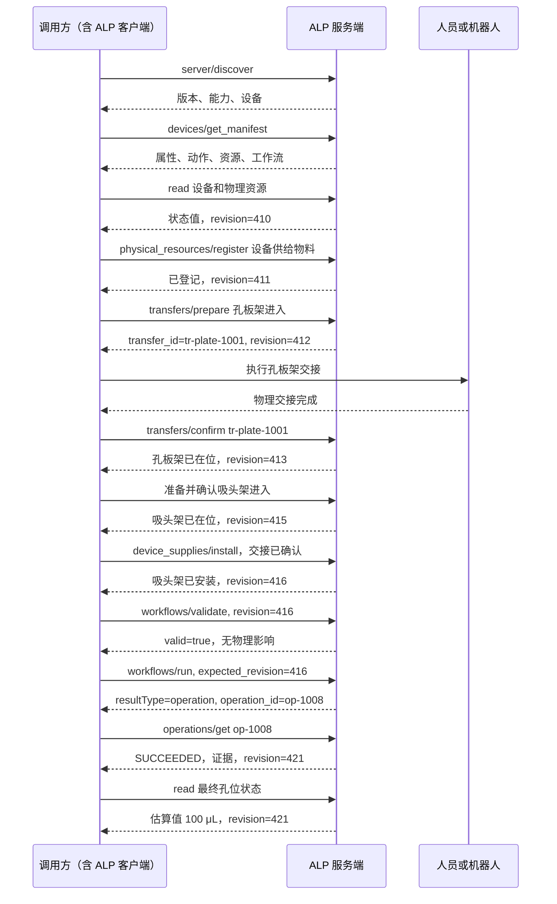

本节仅演示接口组合方式，不定义设备结构、动作名称、容器型号或推荐实验流程。示例目标是从一个源容器取 100 μL，并加入多孔容器的目标位置。

示例中的标识、容量、修订号和动作名均为演示值。

本例选择设备提供的工作流，以展示模板校验、作业对象进出和设备供给物料管理。工作流不是完成该实验的必要条件；未声明工作流能力的设备可以由客户端或设备智能体按同样的前置检查依次调用 `pick_up_tip`、`aspirate_from_source_bottle`、`dispense_to_96_plate_well` 和 `drop_tip`。



## 1. 准备物理资源

| 顺序 | 接口 | 示例作用 |
| --- | --- | --- |
| 1 | `physical_resources/register` | 登记一个未进入设备的设备供给物料，不改变物理位置 |
| 2 | `transfers/prepare` | 为孔板载具进入校验并预留交接点 |
| 3 | 人或机器人交接 | 执行协议之外的物理移动 |
| 4 | `transfers/confirm` | 把容器型作业对象及其子作业对象原子更新为 `present` |
| 5 | `transfers/prepare` + `transfers/confirm` | 以相同方式确认设备供给物料进入 |
| 6 | `device_supplies/install` | 引用已确认的 `transfer_id` 建立安装关系 |

任何一个确认结果不确定时，相关物理资源保持 `unknown`，后续工作流不能启动。具体参数结构使用正文中对应接口的定义，不在本示例重复。

## 2. 检查前置条件

服务端至少检查：

- 工作站处于 `IDLE`；
- 移液枪当前没有旧吸头；
- `example-tip-pack` 已安装且剩余数量至少为 1；
- 原液瓶存在且液量足够；
- 孔板架及其 96 孔板子对象已经通过进入确认，并装载到目标槽位；
- 目标孔位地址有效；
- A1 当前液量加 100 μL 不超过 400 μL；
- 单次吸液和吐液体积在设备范围内；
- 设备没有被其他调用占用；
- 状态修订号没有变化。

## 3. 校验并运行可选工作流

客户端先调用 `workflows/validate`；成功后以相同输入和已验证的修订号运行：

```json
{
  "jsonrpc": "2.0",
  "id": "liquid-run-1",
  "method": "workflows/run",
  "params": {
    "device_id": "example-liquid-sampler",
    "workflow": "example_liquid_transfer",
    "workflow_version": "1.0.0",
    "template_digest": "sha256:example",
    "inputs": {
      "bottle_index": 0,
      "plate_well": "A1",
      "volume_ul": 100
    },
    "options": {
      "expected_revision": 416,
      "deadline": "2026-08-31T12:00:00+08:00",
      "dry_run": false,
      "wait": true,
      "timeout_ms": 90000
    }
  }
}
```

## 4. 解释结果

```json
{
  "resultType": "complete",
  "outcome": "succeeded",
  "workflow": "example_liquid_transfer",
  "workflow_version": "1.0.0",
  "template_revision": 7,
  "template_digest": "sha256:example",
  "result_confirmation": "recommended",
  "previous_revision": 416,
  "new_revision": 421,
  "step_results": [
    {
      "step_id": "pick_tip",
      "outcome": "succeeded"
    },
    {
      "step_id": "aspirate",
      "outcome": "succeeded"
    },
    {
      "step_id": "dispense",
      "outcome": "succeeded"
    },
    {
      "step_id": "drop_tip",
      "outcome": "succeeded"
    }
  ],
  "consumable_changes": [
    {
      "consumable_id": "example-tip-pack",
      "field": "remaining_quantity",
      "previous_value": 96,
      "new_value": 95,
      "quantity_unit": "piece"
    }
  ],
  "evidence": [
    {
      "evidence_id": "ev-controller-1001",
      "quantity": "workflow.dispense.completed",
      "value": true,
      "unit": null,
      "source": "device_readback",
      "quality": "confirmed",
      "captured_at": "2026-08-31T11:58:09+08:00",
      "resource_uri": null
    },
    {
      "evidence_id": "ev-volume-1002",
      "quantity": "plate_96.wells.A1.volume_delta_ul",
      "value": 100,
      "unit": "uL",
      "source": "software_derived",
      "quality": "estimated",
      "captured_at": "2026-08-31T11:58:09+08:00",
      "resource_uri": null
    }
  ],
  "error": null
}
```

该结果按 `recommended` 策略报告：控制器完成位可以确认动作序列已经按设备定义结束，因此工作流的 `outcome` 可以是 `succeeded`；孔内实际增加的 100 μL 仍是软件推导值，所以质量只能是 `estimated`。只有经过验证的液量、称重、流量或视觉测量才能把该物理量标记为 `confirmed`。

如果该动作的策略改为 `required`，而规定的独立测量没有返回，服务端必须把物理结果报告为 `unknown`，即使控制器已经给出完成回执。
