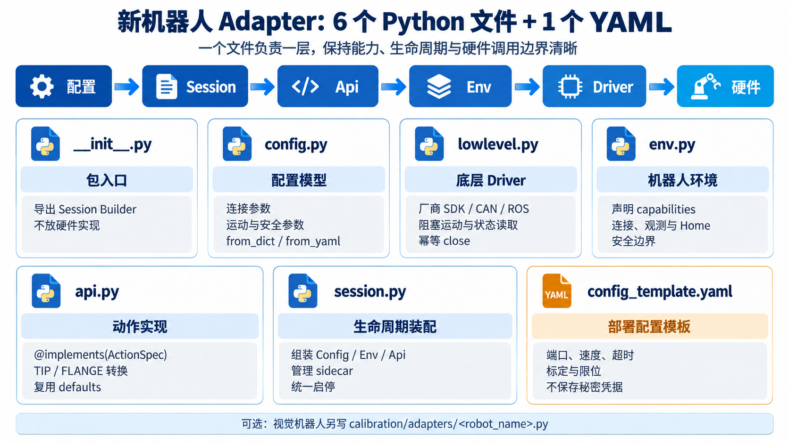
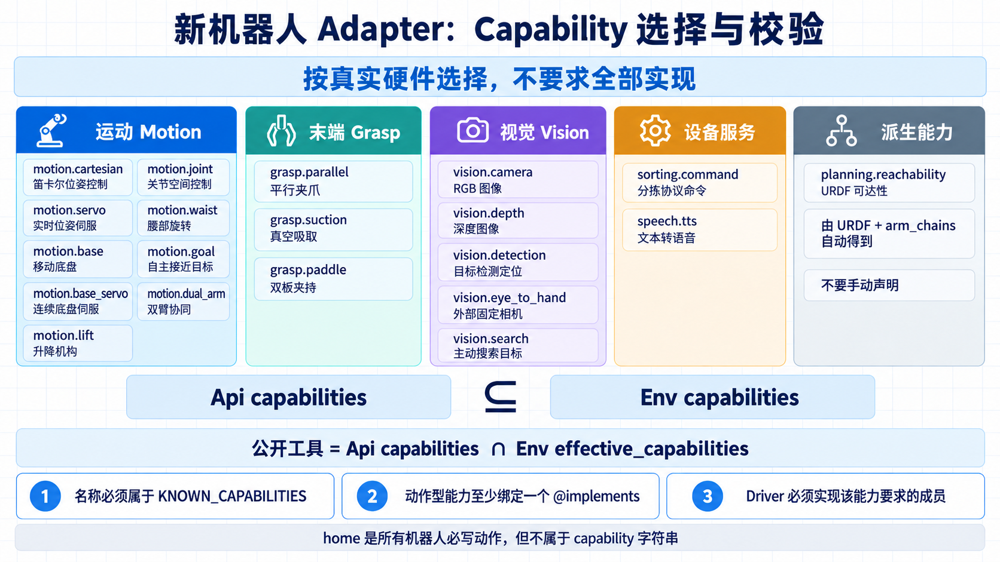

# 新机器人 Adapter 接入指南

本文说明如何按照 JiuwenSymbiosis 的现有设计接入一种新机器人。研究对象为 [GitCode / openJiuwen/jiuwensymbiosis](https://gitcode.com/openJiuwen/jiuwensymbiosis)，内容基于上游仓库提交 [`6becf1e`](https://github.com/openJiuwen-ai/jiuwensymbiosis/commit/6becf1e43a729a9ef393bf620647af6435445f24)，目标是把源码中的 Adapter 契约整理成一份可执行的接入说明。





## Adapter 在系统中的位置

JiuwenSymbiosis 将通用动作语义与机器人本体实现分开。Agent 只看到通过能力筛选后生成的工具；机器人 Adapter 负责把这些动作转换为厂商 SDK、CAN、串口、Socket、ROS 或其他底层调用。

```text
Agent → Rails → Tools → Api → Env → Driver → 机器人硬件
  ↑                                               │
  └────────────── 动作结果、观测和异常 ────────────┘
```

各层职责如下：

| 层 | 职责 |
| --- | --- |
| `ActionSpec` | 定义共享动作的名称、参数、能力条件、结果和状态效果 |
| `Api` | 使用 `@implements(SPEC)` 将共享动作绑定到该机器人的实现 |
| `Env` | 声明真实能力，管理连接、观测、安全属性和 Driver 委托 |
| `Driver` | 将稳定的框架动词转换为厂商硬件接口 |
| `Session` | 装配 Config、Env、Api 和可选 sidecar，统一管理生命周期 |

工具只从 `Api` 与 `Env` 同时支持的能力中生成：

```text
effective capabilities = api.capabilities ∩ env.effective_capabilities
```

因此，Env 声明了能力但 Api 没有绑定对应动作，或者 Api 实现了动作但 Env 没有声明硬件能力，都不会对 Agent 公开该能力。

## 接入前先确定能力和物理约定

开始写文件前，先整理一张机器人能力表。能力必须来自机器人和控制器的真实能力，不能根据已有 Api 动作反推硬件一定支持。

| 项目 | 需要确认的内容 |
| --- | --- |
| 运动 | 笛卡尔、关节、实时伺服、移动底盘、升降、腰部或双臂 |
| 末端执行器 | 平行夹爪、吸盘或其他本体专属机构 |
| 相机 | RGB、深度、帧对齐，以及 eye-in-hand 或 eye-to-hand |
| 坐标系 | 基座、TIP、FLANGE、相机坐标系的方向和变换关系 |
| 单位 | 位置、底盘距离、关节角、姿态角和深度的单位 |
| 完成语义 | 控制器返回“已接收”还是“已到位” |
| 安全 | 工作空间、最低高度、关节限位、控制器限位和物理急停 |
| 恢复 | 断连、超时、动作失败和持物状态下的恢复方式 |

框架中的常用约定是：公共笛卡尔动作使用机器人基座坐标系中的工具 TIP；`Driver.move_to_pose_blocking()` 接收 FLANGE 目标；移动底盘距离使用米；视觉检测位置通常使用毫米；深度图使用米。关节使用角度还是弧度由 Adapter 明确声明，并与关节限位保持一致。

## Capability 要求

新机器人不需要实现全部 capability，只声明真实硬件具备且 Adapter 已接通的能力。固定版本的完整词表如下：

| 类别 | Capability | 中文说明 |
| --- | --- | --- |
| 运动 | `motion.cartesian` | 在基座坐标系中控制末端笛卡尔位姿 |
| 运动 | `motion.joint` | 读取和控制机器人关节位置 |
| 运动 | `motion.servo` | 以非阻塞方式连续发送实时位姿指令 |
| 运动 | `motion.base` | 控制移动底盘进行相对平移和旋转 |
| 运动 | `motion.base_servo` | 在底盘运动过程中连续转向、保持和停止 |
| 运动 | `motion.lift` | 控制升降机构的目标位置 |
| 运动 | `motion.waist` | 控制腰部或躯干偏航旋转 |
| 运动 | `motion.goal` | 通过导航能力自主接近抓取或放置目标 |
| 运动 | `motion.dual_arm` | 协调两条机械臂完成抓取或放置 |
| 末端 | `grasp.parallel` | 控制平行夹爪打开和闭合 |
| 末端 | `grasp.suction` | 控制真空吸盘吸取和释放 |
| 末端 | `grasp.paddle` | 使用两块夹板从物体两侧夹持 |
| 视觉 | `vision.camera` | 获取 RGB 图像并提供相机内参 |
| 视觉 | `vision.depth` | 获取与 RGB 对齐的深度数据 |
| 视觉 | `vision.detection` | 检测目标并计算抓取或放置位置 |
| 视觉 | `vision.eye_to_hand` | 使用固定在机器人外部的相机标定 |
| 视觉 | `vision.search` | 转动相机载体或底盘主动搜索目标 |
| 设备服务 | `sorting.command` | 调用不依赖笛卡尔运动的分拣协议命令 |
| 设备服务 | `speech.tts` | 将文本转换为机器人语音输出 |
| 派生能力 | `planning.reachability` | 根据 `urdf_path` 和 `arm_chains` 推导运动学可达性，不手动声明 |

每项声明必须满足：

1. 名称存在于 `env/base.py:KNOWN_CAPABILITIES`；
2. Api 通过 `@implements(SPEC)` 绑定该能力下至少一个动作；没有公共动作的标记能力除外；
3. `api.capabilities` 是 `env.capabilities` 的子集；
4. Driver 实现 `capability_spec.py:CAPABILITY_DRIVER_MEMBERS` 要求的成员；
5. 最终公开工具取 `api.capabilities ∩ env.effective_capabilities`。

`home` 是所有机器人必须实现的动作，但它不属于 capability 字符串。

## 必须编写的文件

一个标准 Adapter 包含 6 个 Python 文件和 1 份 YAML 配置模板：

```text
jiuwensymbiosis/adapters/<robot_name>/
├── __init__.py
├── config.py
├── lowlevel.py
├── env.py
├── api.py
├── session.py
└── config_template.yaml
```

如果机器人需要手眼标定，再增加：

```text
jiuwensymbiosis/calibration/adapters/<robot_name>.py
```

可以从 `templates/xxx_adapter/` 复制模板，也可以使用 `scripts/new_adapter` 生成初始目录。生成结果只是起点，能力、Protocol、坐标转换和安全参数仍需按真机修改。

### `__init__.py`：包入口

只导出命名后的 Session builder，供外部统一创建机器人会话。这里不放硬件连接或动作实现。

```python
from .session import build_my_robot_session

__all__ = ["build_my_robot_session"]
```

### `config.py`：配置模型

Config 保存部署时会变化的参数，并提供 `from_dict()` 和 `from_yaml()`。常见字段包括：

- CAN、串口、IP 地址和端口；
- 运动速度、加速度和超时；
- Home 位姿、工具偏移和姿态约定；
- 最低高度、XY 工作空间和关节软限位；
- 夹爪、吸盘或其他执行器参数；
- 相机序列号、分辨率、FPS 和标定文件；
- 检测服务 URL、启动方式、模型和阈值。

Config 不连接硬件，不保存用户任务，也不把密码或令牌写入配置模板。

### `lowlevel.py`：底层 Driver

Driver 封装厂商 SDK 和设备 I/O。它不依赖 Agent、Rails 或 `@implements`，只提供稳定的硬件动词。

JiuwenSymbiosis 使用 `typing.Protocol` 按能力切分 Driver 接口。具体 Driver 无需继承这些 Protocol，只要成员结构匹配即可。每台机器人只实现实际拥有的能力，避免为不支持的功能编写 `NotImplementedError` 桩。

| Protocol | 能力 | 主要成员 |
| --- | --- | --- |
| `RobotDriver` | 所有机器人 | `close()`，且必须幂等 |
| `CartesianDriver` | `motion.cartesian` | `home()`、`get_pose()`、`move_to_pose_blocking()`、Home 与工具偏移属性 |
| `JointDriver` | 索引式关节控制 | `get_angles()`、`move_joint_blocking()` |
| `NamedJointDriver` | 命名式关节控制 | `get_joint_positions()`、`move_joints_blocking()` |
| `ServoDriver` | `motion.servo` | 非阻塞的 `servo_to_pose()` |
| `BaseDriver` | `motion.base` | `navigate_relative()`、`navigate_arc()` |
| `ContinuousBaseDriver` | `motion.base_servo` | 启动、转向、保持、停止连续底盘运动 |
| `LifterDriver` | `motion.lift` | `set_lifter()` |
| `WaistDriver` | `motion.waist` | `turn_waist()` |
| `DualArmDriver` | `motion.dual_arm` | 双臂归位和本体协同所需接口 |
| `GripperDriver` | `grasp.parallel` | `set_gripper()`、`gripper_state` |
| `SuctionDriver` | `grasp.suction` | `set_suction()` 和吸盘状态 |
| `CameraDriver` | `vision.camera` | `intrinsics`、`grab_frames()` |
| `VisionDriver` | eye-in-hand 检测 | `tf_flange_cam`、`calibration` |

Driver 的关键行为要求：

- 连接和关闭可重复调用，失败清理后可以重新连接；
- 阻塞运动必须等待到位或明确失败，不能只等待控制器接收命令；
- 超时、不可达、通信中断和畸形状态必须向上抛出可定位的异常；
- RGB 与深度存在时，`grab_frames()` 返回对齐的 `(rgb_uint8, depth_m_float32)`；
- 软件边界不能替代控制器硬限位和物理急停；
- SDK 不支持并发时，在 Driver 内串行化运动、相机和状态访问。

### `env.py`：机器人环境

Env 继承 `BaseRobotEnv`，是 Tools 和 Rails 使用的硬件边界。它负责：

1. 用 `capabilities` 声明硬件真实能力；
2. 实现幂等的 `connect()` 和 `disconnect()`；
3. 实现 `home()`；
4. 用 `get_observation()` 返回最佳努力的机器人快照；
5. 暴露安全范围、Home、工具偏移和持物状态；
6. 将运动、末端和相机操作委托给 Driver。

```python
class MyRobotEnv(BaseRobotEnv):
    capabilities = frozenset({
        "motion.cartesian",
        "grasp.parallel",
        "vision.camera",
    })
```

`get_observation()` 可返回位姿、关节、RGB、深度和轻量扩展状态。某个传感器短暂缺失时，应将对应字段设为 `None`，而不是让整次观测失败。

按机器人能力设置以下属性：

| 属性 | 含义 |
| --- | --- |
| `home_pose` | 安全 Home 位姿 |
| `tool_offset_mm` | TIP 与 FLANGE 的工具偏移 |
| `z_min_safe` | TIP 的最低安全高度 |
| `workspace_bounds` | XY 工作空间边界 |
| `joint_limits` | 关节软限位 |
| `joint_units` | `"deg"` 或 `"rad"` |
| `base_step_limits` | 底盘单次平移和旋转上限 |
| `lift_limits` | 升降机构软限位 |
| `waist_step_limit_rad` | 腰部单次旋转上限 |
| `holding_payload` | 恢复流程判断机器人是否正在持物 |

没有配置的安全属性表示该项未检查，不能解释为检查通过。`BaseRobotEnv.emergency_stop()` 的默认实现也不等于机器人具备物理急停。

### `api.py`：共享动作的本体实现

Api 继承 `BaseRobotApi`，使用 `@implements(SPEC)` 绑定机器人支持的共享动作。动作契约集中定义在 `jiuwensymbiosis/api/actions.py`，包括动作名称、能力条件、参数、结果和状态效果。

```python
class MyRobotApi(BaseRobotApi):
    @implements(GOTO_XYZR)
    def goto_xyzr(
        self,
        x: float,
        y: float,
        z: float,
        r: float | None = None,
        *,
        orientation_policy: str = "top_down",
    ) -> None:
        return defaults.goto_xyzr(self, x, y, z, r)
```

实现时遵循三条规则：

- 公共默认行为与本体一致时，一行转发给 `api/defaults.py`；
- TIP/FLANGE、姿态、字段或机型几何不同，才在 Api 中覆写；
- bring-up、标定和调试属于脚本或普通方法，不使用 `@implements` 暴露给规划器。

`@implements` 会检查方法签名能否接收 `ActionSpec` 承诺的参数，并基于该机器人方法签名生成工具输入 Schema。共享动作名称相同，不代表不同机器人的姿态能力、参数范围和结果细节完全相同。

TIP 到 FLANGE 的转换属于 Api。垂直工具可以使用标量偏移；倾斜工具必须使用完整刚体变换。不要把坐标修正藏进提示词或 Driver 的不透明常量。

### `session.py`：生命周期装配

Session 使用共享 `make_builder()` 装配 Config、Env 和 Api：

```python
build_my_robot_session = make_builder(
    MyRobotConfig,
    MyRobotEnv,
    MyRobotApi,
)
```

Builder 支持直接传 Config，也支持 `.from_yaml(path)` 和 `.from_dict(data)`。需要把配置字段传给 Api 时，使用 `api_kwargs_from_cfg`；需要本地检测服务时，使用 `sidecar_builders`。Sidecar 必须是上下文管理器，并随 Session 一起启动和停止。

创建 Session 只完成对象装配。硬件连接应由 Session 上下文进入时统一建立，退出时统一释放。

### `config_template.yaml`：部署起点

模板应列出该机器人实际需要的连接、运动、安全、相机和检测配置，并为单位和物理含义提供中文注释。不要加入示例任务或秘密凭据。

```yaml
name: my_robot
connection:
  port: can0
motion:
  timeout_s: 30
  tool_offset_mm: 120.0
safety:
  z_min_safe_mm: 40.0
```

## 视觉与标定的可选工作

只有具备相机或检测能力的机器人需要这一部分。

- eye-in-hand 机器人提供实时 `T_base_flange` 和固定 `T_flange_cam`；
- eye-to-hand 机器人提供固定 `T_base_cam`；
- 相机内参、深度单位、RGB/深度对齐和变换方向必须实测；
- `pixel_to_base_xyz()` 在 Api 中绑定共享动作，并调用共享投影或机型专属实现；
- 检测服务可由 Session sidecar 管理；
- 手眼标定 wrapper 放在 `jiuwensymbiosis/calibration/adapters/`，并暴露 `CALIBRATION_ADAPTER_SPEC`。

校正参数用于补偿小范围系统误差，不能掩盖错误的单位、变换方向或松动的相机安装。

## 推荐接入顺序

1. 记录能力、坐标系、单位、完成语义和安全边界。
2. 从 `templates/xxx_adapter/` 生成或复制 Adapter 目录。
3. 完成 `config.py` 和 `config_template.yaml`。
4. 在 `lowlevel.py` 接通连接、状态和幂等关闭。
5. 依次接通 Home、一个安全位姿、关节或底盘、末端执行器和相机。
6. 在 `env.py` 声明真实能力，并补齐观测和安全属性。
7. 在 `api.py` 绑定共享动作，只覆写本体差异。
8. 在 `session.py` 完成 Config、Env、Api 和可选 sidecar 装配。
9. 需要视觉时再接入检测、投影和标定 wrapper。
10. 先完成静态与 Mock 验证，再进行低速真机验收。

不要一次同时替换所有 Mock 功能。每接通一层就验证一次，能更快定位问题属于 Driver、Env、Api 还是装配层。

## 验证 Adapter

先运行上游提供的检查：

```bash
python scripts/validate_adapter.py \
  --module jiuwensymbiosis.adapters.my_robot

python scripts/smoke_test_adapter.py \
  --module jiuwensymbiosis.adapters.my_robot \
  --config configs/my_robot/default.yaml
```

静态验证检查目录、动作签名、能力和 Driver 成员是否对齐；Mock 冒烟检查创建 Session、生成工具、调用动作并检查结果能否表示。它们不能替代真实硬件验收。

真机验收至少覆盖：

- Session 能多次连接、断开并正确释放资源；
- `effective_capabilities` 只包含硬件真实支持的能力；
- Home、单个安全位姿、末端开闭和相机采集分别通过；
- TIP、FLANGE、基座和相机坐标转换经过多个工作区位置实测；
- 单位、限位、超时、不可达、断连和控制器拒绝能正确上报；
- 持物状态下不会执行危险的自动归位；
- 软件范围、控制器硬限位和物理急停均完成验证。

## 完成标准

一个新机器人接入完成，应同时满足：

- 6 个必需 Python 文件和 YAML 配置模板职责清晰；
- Driver 只实现真实能力对应的 Protocol，并具有正确的阻塞、单位和错误语义；
- Env 能力、Api 动作和 Driver 成员相互一致；
- Config 可从 YAML 和字典加载，Session 可完整启停；
- 坐标、工具偏移、安全边界和可选标定均已书面化并实测；
- 静态验证、Mock 冒烟、相关单元检查和低速真机验收全部通过。

现有实现可参考 `jiuwensymbiosis/adapters/piper/`、`jiuwensymbiosis/adapters/so101/` 和 `jiuwensymbiosis/adapters/cruzr/`。Piper 展示六轴机械臂、夹爪、腕部相机和倾斜工具变换；SO-101 展示欠驱动姿态约束与 eye-to-hand 视觉；Cruzr 展示底盘、腰部、升降和双臂等多能力组合。
